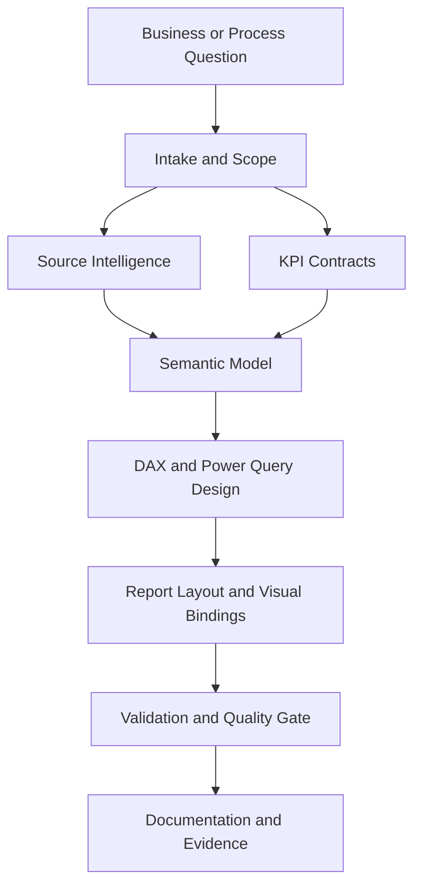

# Architecture

The repository is organized as a Codex plugin plus an executable Power BI trust layer.

## Main Layers

## Repository Layers

- `plugins/powerbi-business-intelligence/`: Codex plugin metadata, plugin README, assets, docs, and skills.
- `scripts/`: executable validators and smoke-test helpers.
- `schemas/`: machine-readable contracts for KPI, evidence, orchestration, RLS, and acceptance artifacts.
- `templates/`: process packs, report QA templates, admin scan plans, and delivery templates.
- `data/`: connector and capability matrices.
- `outputs/`: generated sample artifacts and validation evidence.
- `docs/product/`: detailed product, process, source, KPI, and skill documentation.
- `docs/internal/`: internal planning, rollout, bilingual policy, and simulation notes.

## Design Rules

- KPI contracts come before DAX.
- Source-system metadata comes before Power Query generation.
- Star-schema quality comes before report design.
- Generated reports require visual-binding validation.
- Generated Power BI artifacts require validation evidence before release.
- Secrets, credentials, tenant IDs, and customer-sensitive data must stay out of the repository.
