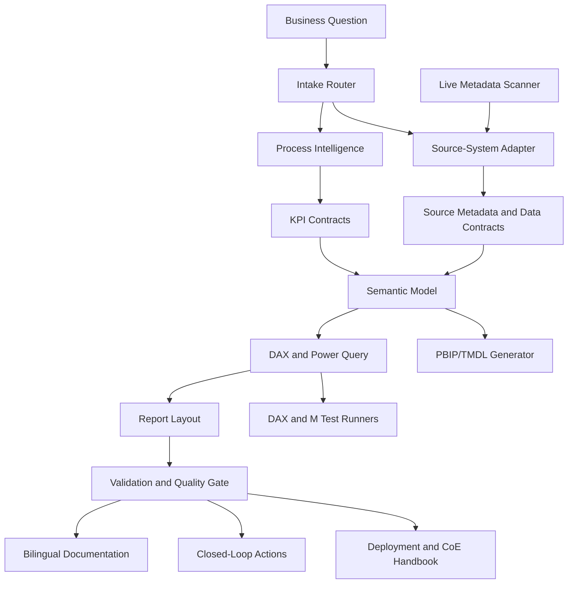

# Architecture

<!-- bilingual-doc-header -->
## en-US Documentation

This document explains the layered architecture of the Power BI Expert-Replacement Factory: intake, source intelligence, KPI governance, semantic modelling, AI/KI guardrails, delivery, documentation, and the executable factory layer. Use it when designing or reviewing the overall product architecture.

## de-DE Dokumentation

Dieses Dokument erklaert die Schichtenarchitektur der Power BI Expert-Replacement Factory: Intake, Quellenintelligenz, KPI-Governance, semantische Modellierung, AI/KI-Guardrails, Delivery, Dokumentation und die ausfuehrbare Factory-Schicht. Nutze es fuer Architekturdesign und Architektur-Reviews.

<!-- /bilingual-doc-header -->

## Layered Plugin Model

## Main Layers

### 1. Intake and Routing

Classifies the request by:

- Business domain.
- Process chain.
- Source system.
- Delivery artifact.
- Risk level.
- Reuse potential.
- Required expert role.

### 2. Source-System Intelligence

Maps business questions to likely source objects, including:

- ERP and CRM objects.
- MES, PLM, WMS/WHS, TMS, QMS, EHS, EPM, treasury, ESG, and field service systems.
- Lakehouse, warehouse, API, file, and SaaS patterns.

Concrete tables and fields are treated as candidates until validated against customer metadata.

### 3. KPI Governance

Defines:

- KPI name and synonyms.
- Numerator and denominator.
- Date basis.
- Inclusion and exclusion rules.
- Grain.
- Owner.
- Reconciliation source.
- Acceptance tolerance.

### 4. Semantic Model Factory

Creates model patterns for:

- Facts, dimensions, bridge tables, and role-playing dates.
- Slowly changing dimensions.
- Many-to-many risk handling.
- RLS/OLS.
- Incremental refresh.
- Import, DirectQuery, Direct Lake, or composite models.

### 5. AI/KI Guardrails

AI outputs must be checked against:

- Source metadata.
- KPI contracts.
- DAX and Power Query tests.
- Source reconciliation totals.
- Lineage and ownership.
- Insight confidence scoring.
- Hallucination guard.

### 6. Delivery and Documentation

Substantial outputs should include:

- Implementation spec.
- Validation plan.
- Quality gate evidence.
- Release checklist.
- Owner acceptance.
- `en-US` and `de-DE` documentation.

### 7. Executable Factory Layer

The executable factory layer turns advisory designs into buildable assets:

- Live metadata scan plans.
- PBIP/TMDL model structures.
- DAX unit test packs.
- Power Query/M extraction designs.
- Visual layout specifications.
- Fabric deployment blueprints.
- Acceptance test packs.
- Migration cost estimates.
- CoE operating handbooks.
- Machine-readable skill indexes.
